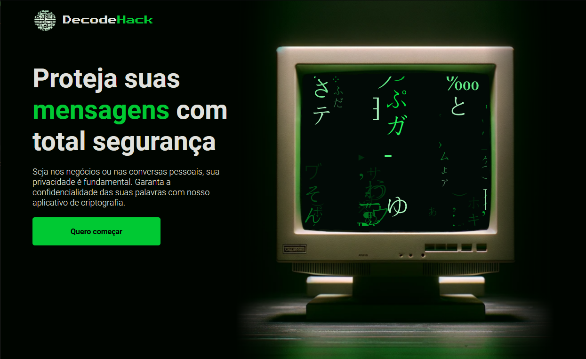

# 🔒 DecodeHack

Aplicativo web de criptografia/descriptografia de texto desenvolvido como desafio da Oracle Next Education e Alura.

## 🚀 Funcionamento
O aplicativo permite que o usuário criptografe ou descriptografe textos de forma simples e sem burocracias. Basta digitar o texto na "imagem do monitor" e clicar em "Criptografar" ou "Descriptografar".

{width=50%}

Não é necessário inserir chaves secretas. O sistema de criptografia utiliza substituições simples de letras.

## 💻 Tecnologias
- HTML
- CSS 
- JavaScript

## 📝 Como usar
1. Acesse [DecodeHack](https://imrob-s.github.io/challenge-decodehack/)
2. Digite o texto na área indicada
3. Clique em "Criptografar" ou "Descriptografar" 
4. Veja o resultado na tela

## 🔑 Sistema de Criptografia
As letras são convertidas da seguinte forma:
- e -> enter
- i -> imes 
- a -> ai
- o -> ober
- u -> ufat

## 📄 Licença
Este projeto está sob a licença GPL-3.0.

Espero que este `README.md` capture as principais informações sobre o aplicativo DecodeHack de forma sucinta e objetiva. Fique à vontade para sugerir quaisquer melhorias!

